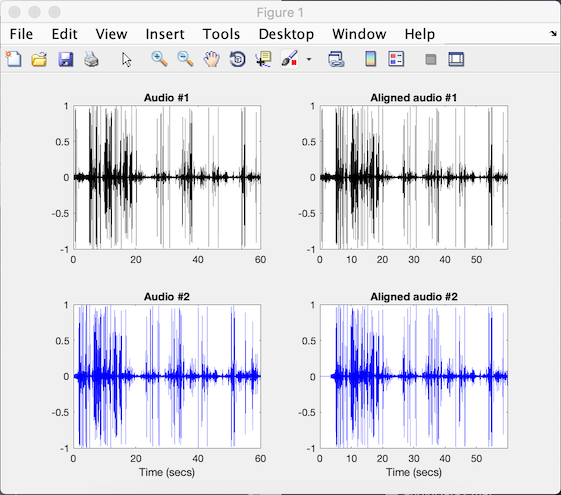

# Introduction

This MATLAB package extracts the lag data between two non-synchronised video 
streams. Type

    help PTV.parSyncVideos

or

    doc PTV.parSyncVideos

anytime in the MATLAB Command Window to recall the following documentation.

# Usage
 ```matlab
    % path to video-containg folder or to single video
    pathToFrames = '/path/to/images';
    videoSetLeftCamera = '/path/to/videos/from/left/camera';
    videoSetRightCamera = '/path/to/videos/from/right/camera';
    mexopencvPath = '/path/to/opencv/mex/files';

    obj = PTV.parSyncVideos(videoSetLeftCamera, videoSetRightCamera, mexopencvPath);
    obj = PTV.parSyncVideos(..., 'audioWindowSize', 48000*50);
    obj = PTV.parSyncVideos(..., 'frameStep', 300);
```

  `PTV.parSyncVideos()` requires the following parameters:
   1) **videoSetLeftCamera**: path to a video  or a folder containing all videos recorded from left camera
   2) **videoSetRightCamera**: path to a video  or a folder containing all videos recorded from right camera
   3) **mexopencvPath**: path to mexopencv library.

`obj = PTV.parSyncVideos(..., Name, Value)` specifies additional name-value pairs described below:

- **videoFileExtension** -  Extension of the video files . Default: 'MP4'
- **frameStep** -      Step to use for the video frames. The delay will be estimated every 'frameStep' frames. Default: 100
- **audioWindowSize** -      Length of the window (as number of audio samples) to use when performing the auto-correlation of the two audio signals. This must include the time instant of the delay. If one camera was started after 1 min from the other one, set this larger than 48000\*60. Default: 48000\*60
- **workers** -  Number of parallel workers to use. This depends on the available cores/memory on your system. Default: 2


`obj = PTV.parSyncVideos(...)` returns a *parSyncVideos* object containing the output of the lag estimation.

# parSyncVideos properties
 - **videoSetLeftCamera**      - Complete path to the folder containing the set of video files or path to a video from the left camera
 - **videoSetRightCamera**      - Complete path to the folder containing the set of video files or path to a video from the right camera
 - **frameRate**      - The video frame rate
 - **totalVideos**    - The total processed videos
 - **framesSetLeft**     - The number of frames in each video file from the set from the left camera
 - **framesSetRight**     - The number of frames in each video file from the set from the right camera
 - **totalFramesLeftCamera**      - The total frames in video set from the left camera
 - **totalFramesRightCamera**      - The total frames in video set from the right camera
 - **audioSamplingFrequency**  - The video frame rate
 - **totalAudioSamples**  - Total audio samples
 - **lag**            - The lag output table with the following variables
   - `time`: time from left video
   - `F1`: synced frame from left video
   - `F2`:  synced frame from right video
   - `D`: audio delay
   - `L`: video delay
   - `L_tilde`: rounded video delay
   - `tau`: `L_tilde`-`l`
 - **lagMessage**     - The message about lag
 - **lagTracking**    - Struct array used by the tracking alghoritm

`obj = PTV.parSyncVideos(...)` provides the following public methods:

- **toStruct**        - Convert class properties to a structure variable
- **interp**          - In case 'frameStep' is not set to 1, interpolate linearly the 'lag' table data so that the frame step for F1 is 1. Setting 'frameStep' to 1 may take a long time to sync the videos. The method updates `this.lag` with the new interpolated table.
- **save**            - Save the lag data to a MAT file to be used in the track algorithm. Specify the output file name as input of the method.

Once the audio tracks have been read, the program plots the first chunk of synchronised audio tracks:



It then proceeds estimating the audio delay for the frames. The program shows a progress bar with the total number of samples/frames that have been processed. 

The synchornised frame data are stored in `obj.lag`.

 # Example
 ```matlab
    clc; clear; close all;
    delete(findall(0,'type','figure','tag','TMWWaitbar'));

    addpath('/path/to/ptv/package');

    import PTV.*

    videoSetLeftCamera = '/Volumes/stereo_cameras/lake/deployment_1/left/';
    videoSetRightCamera = '/Volumes/stereo_cameras/lake/deployment_1/right/';
    mexopencvPath  = '/Users/yourUser/Documents/MATLAB/mexopencv-d29007b';

    obj = PTV.parSyncVideos(videoSetLeftCamera, videoSetRightCamera, mexopencvPath, ...     
      'frameStep', 50, 'workers', 3);

    % Plot
    figure;
    subplot(211); hold on;
    plot(obj.lag.time, obj.lag.L, 'k--');
    plot(obj.lag.time, obj.lag.L_tilde, 'b-');

    subplot(212);
    plot(obj.lag.time, obj.lag.L - obj.lag.L_tilde, 'k-');

    % Save
    obj = obj.interp();
    obj.save('syncData.mat');
```
