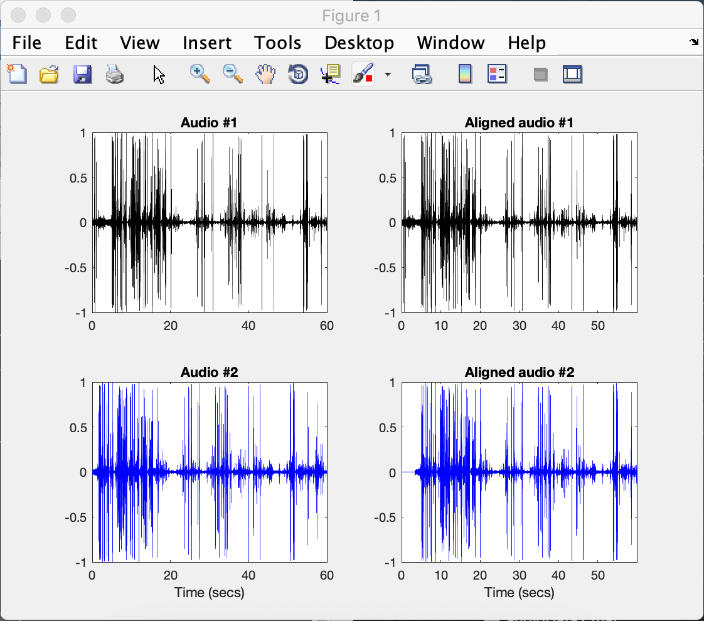
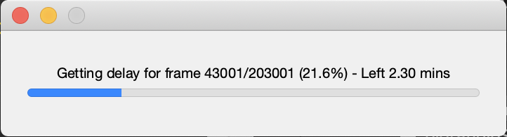

# Introduction

This MATLAB package performs the stereo camera system using the
vision toolbox provided by MATLAB. Type

    help PTV.syncVideos

or

    doc PTV.syncVideos

anytime in the MATLAB Command Window to recall the following documentation.

# Usage
 ```javascript
    pathToFrames = '/path/to/images';
    videoSet1 = '/path/to/files/in/first/set';
    videoSet2 = '/path/to/files/in/second/set';
    mexopencvPath = '/path/to/opencv/mex/files';

    obj = PTV.syncVideos(videoSet1, videoSet2, mexopencvPath);
    obj = PTV.syncVideos(..., 'audioWindowSize', 48000*50);
    obj = PTV.syncVideos(..., 'frameStep', 300);
```

`obj = PTV.syncVideos(..., Name, Value)` specifies additional name-value pairs described below:

- **videoFileExtension** -  Extension of the video files . Default: 'MP4'
- **frameStep** -      Step to use for the video frames. The delay will be estimated every 'frameStep' frames. Default: 100
- **audioWindowSize** -      Length of the window (as number of audio samples) to use when performing the auto-correlation of the two audio signals. This must include the time instant of the delay. If one camera was started after 1 min from the other one, set this larger than 48000\*60. Default: 48000\*60

`obj = PTV.syncVideos(...)` returns a *syncVideos* object containing the output of the lag estimation.

# syncVideos properties
 - **videoSet1**      - Complete path to the folder containing the 1st set of video files
 - **videoSet2**      - Complete path to the folder containing the 2nd set of video files
 - **frameRate**      - The video frame rate
 - **totalVideos**    - The total processed videos
 - **framesSet1**     - The number of frames in each video files from 1st set
 - **framesSet2**     - The number of frames in each video files from 2nd set
 - **totalFramesCamera1**      - The total frames in 1st set
 - **totalFramesCamera2**      - The total frames in 2nd set
 - **audioSamplingFrequency**  - The video frame rate
 - **lag**            - The lag output table with *D*, *L*, *L_tilde* and *Tau*
 - **lagMessage**     - The message about lag
 - **lagTracking**    - Struct array used by the tracking alghoritm

Once the audio tracks have been read, the program plot the first chunk of synchronised tracks



It then proceed estimating the audio delay for the frames




 # Example
 ```javascript
    clc; clear; close all;
    delete(findall(0,'type','figure','tag','TMWWaitbar'));

    addpath('../../');

    import PTV.*

    videoSet1 = '/Volumes/stereo_cameras/lake/deployment_1/left/';
    videoSet2 = '/Volumes/stereo_cameras/lake/deployment_1/right/';
    mexopencvPath  = '/Users/yourUser/Documents/MATLAB/mexopencv-d29007b';

    obj = PTV.syncVideos(videoSet1, videoSet2, mexopencvPath, 'frameStep', 500);

    % Plot
    figure; 
    subplot(211); hold on;
    plot(obj.lag.time, obj.lag.L, 'k--');
    plot(obj.lag.time, obj.lag.L_tilde, 'b-');

    subplot(212);
    plot(obj.lag.time, obj.lag.L - obj.lag.L_tilde, 'k-');

    % Save
    data = obj.toStruct();
    save('syncData.mat', 'data');
```
